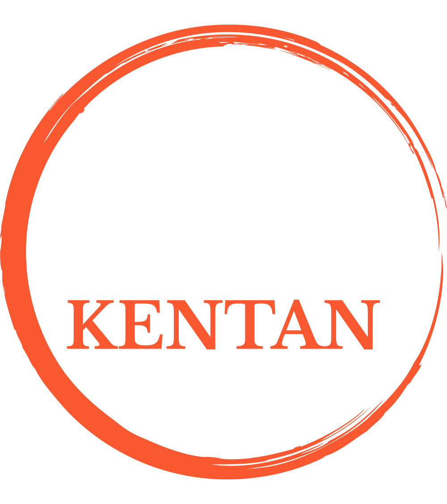
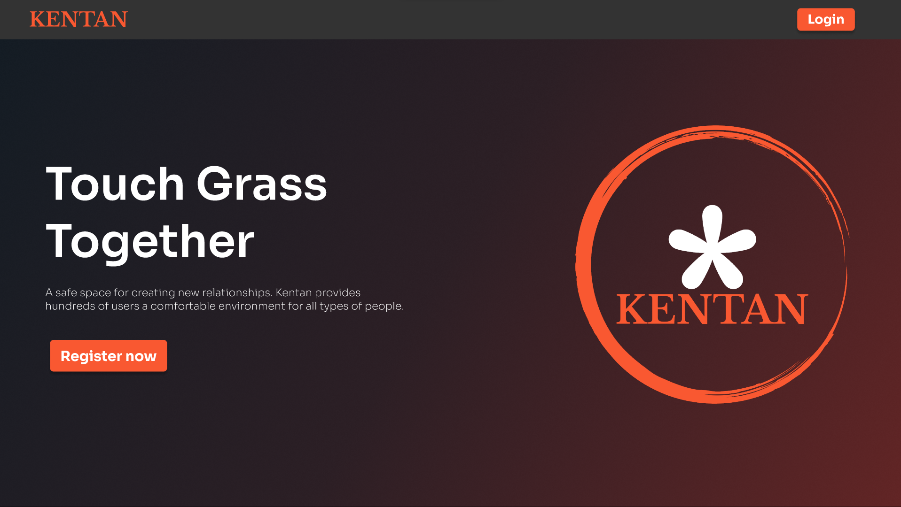

<!-- Improved compatibility of back to top link: See: https://github.com/othneildrew/Best-README-Template/pull/73 -->
<a name="readme-top"></a>
<!--
*** Thanks for checking out the Best-README-Template. If you have a suggestion
*** that would make this better, please fork the repo and create a pull request
*** or simply open an issue with the tag "enhancement".
*** Don't forget to give the project a star!
*** Thanks again! Now go create something AMAZING! :D
-->


<!-- PROJECT SHIELDS -->
<!--
*** I'm using markdown "reference style" links for readability.
*** Reference links are enclosed in brackets [ ] instead of parentheses ( ).
*** See the bottom of this document for the declaration of the reference variables
*** for contributors-url, forks-url, etc. This is an optional, concise syntax you may use.
*** https://www.markdownguide.org/basic-syntax/#reference-style-links
-->
[![Contributors][contributors-shield]][contributors-url]
[![Forks][forks-shield]][forks-url]
[![Stargazers][stars-shield]][stars-url]
[![Issues][issues-shield]][issues-url]
[![MIT License][license-shield]][license-url]
[![LinkedIn][linkedin-shield]][linkedin-url]


<!-- PROJECT LOGO -->
<br />
<div align="center">
  <a href="https://github.com/Moltenfuzzy/Kentan">
    
  </a>

<h3 align="center">Kentan</h3>

  <p align="center">
    A social networking web application for ...
    <br />
    <a href="https://github.com/Moltenfuzzy/Kentan"><strong>Explore the docs »</strong></a>
    <br />
    <br />
    <a href="https://github.com/Moltenfuzzy/Kentan">View Demo</a>
    ·
    <a href="https://github.com/Moltenfuzzy/Kentan/issues">Report Bug</a>
    ·
    <a href="https://github.com/Moltenfuzzy/Kentan/issues">Request Feature</a>
  </p>
</div>


<!-- TABLE OF CONTENTS -->
<details>
  <summary>Table of Contents</summary>
  <ol>
    <li>
      <a href="#about-the-project">About The Project</a>
      <ul>
        <li><a href="#built-with">Built With</a></li>
      </ul>
    </li>
    <li>
      <a href="#getting-started">Getting Started</a>
      <ul>
        <li><a href="#prerequisites">Prerequisites</a></li>
        <li><a href="#installation">Installation</a></li>
      </ul>
    </li>
    <li><a href="#usage">Usage</a></li>
    <li><a href="#roadmap">Roadmap</a></li>
    <li><a href="#contributing">Contributing</a></li>
    <li><a href="#license">License</a></li>
    <li><a href="#contact">Contact</a></li>
    <li><a href="#acknowledgments">Acknowledgments</a></li>
  </ol>
</details>


<!-- ABOUT THE PROJECT -->
## About The Project

[](https://example.com)

<!-- Here's a blank template to get started: To avoid retyping too much info. Do a search and replace with your text editor for the following: `Moltenfuzzy`, `Kentan`, `twitter_handle`, `linkedin_username`, `email_client`, `email`, `project_title`, `project_description` -->

<p align="right">(<a href="#readme-top">back to top</a>)</p>


### Built With

* [![Next.js]][Next-url]
* [![ApolloGraphQL]][ApolloGraphQL-url]
* [![TypeScript]][TypeScript-url]
* [![MongoDB]][MongoDB-url]
* [![Type-graphql]][Type-graphql-url]


<p align="right">(<a href="#readme-top">back to top</a>)</p>


<!-- GETTING STARTED -->
## Getting Started

This is an example of how you may give instructions on setting up your project locally.
To get a local copy up and running follow these simple example steps.

### Prerequisites

This is an example of how to list things you need to use the software and how to install them.
* yarn

### Installation

TODO: Add installation instructions

<!-- 1. Get a free API Key at [https://example.com](https://example.com)
2. Clone the repo
   ```sh
   git clone https://github.com/Moltenfuzzy/Kentan.git
   ```
3. Install NPM packages
   ```sh
   npm install
   ```
4. Enter your API in `config.js`
   ```js
   const API_KEY = 'ENTER YOUR API';
   ``` -->

<p align="right">(<a href="#readme-top">back to top</a>)</p>


<!-- USAGE EXAMPLES -->
## Usage

Use this space to show useful examples of how a project can be used. Additional screenshots, code examples and demos work well in this space. You may also link to more resources.

_For more examples, please refer to the [Documentation](https://example.com)_

<p align="right">(<a href="#readme-top">back to top</a>)</p>


<!-- ROADMAP -->
<!-- ## Roadmap

- [ ] Feature 1
- [ ] Feature 2
- [ ] Feature 3
    - [ ] Nested Feature -->

See the [open issues](https://github.com/Moltenfuzzy/Kentan/issues) for a full list of proposed features (and known issues).

<p align="right">(<a href="#readme-top">back to top</a>)</p>


<!-- CONTRIBUTING -->
## Contributing

Contributions are what make the open source community such an amazing place to learn, inspire, and create. Any contributions you make are **greatly appreciated**.

If you have a suggestion that would make this better, please fork the repo and create a pull request. You can also simply open an issue with the tag "enhancement".
Don't forget to give the project a star! Thanks again!

1. Fork the Project
2. Create your Feature Branch (`git checkout -b feature/AmazingFeature`)
3. Commit your Changes (`git commit -m 'Add some AmazingFeature'`)
4. Push to the Branch (`git push origin feature/AmazingFeature`)
5. Open a Pull Request

<p align="right">(<a href="#readme-top">back to top</a>)</p>


<!-- LICENSE -->
## License

Distributed under the MIT License. See `LICENSE.txt` for more information.

<p align="right">(<a href="#readme-top">back to top</a>)</p>


<!-- CONTACT -->
## Contact

Your Name - [@twitter_handle](https://twitter.com/twitter_handle) - email@email_client.com

Project Link: [https://github.com/Moltenfuzzy/Kentan](https://github.com/Moltenfuzzy/Kentan)

<p align="right">(<a href="#readme-top">back to top</a>)</p>


<!-- ACKNOWLEDGMENTS -->
## Acknowledgments

<!-- * []()
* []()
* []() -->

<p align="right">(<a href="#readme-top">back to top</a>)</p>


<!-- MARKDOWN LINKS & IMAGES -->
<!-- https://www.markdownguide.org/basic-syntax/#reference-style-links -->
<!-- https://img.shields.io/github/forks/othneildrew/Best-README-Template.svg?style=for-the-badge -->

[contributors-shield]: https://img.shields.io/github/contributors/Moltenfuzzy/EatDeez.svg?style=for-the-badge
[contributors-url]: https://github.com/Moltenfuzzy/EatDeez/graphs/contributors
[forks-shield]: https://img.shields.io/github/forks/Moltenfuzzy/EatDeez.svg?style=for-the-badge
[forks-url]: https://github.com/Moltenfuzzy/EatDeez/network/members
[stars-shield]: https://img.shields.io/github/stars/Moltenfuzzy/EatDeez.svg?style=for-the-badge
[stars-url]: https://github.com/Moltenfuzzy/EatDeez/stargazers
[issues-shield]: https://img.shields.io/github/issues/Moltenfuzzy/EatDeez.svg?style=for-the-badge
[issues-url]: https://github.com/Moltenfuzzy/EatDeez/issues
[license-shield]: https://img.shields.io/github/license/Moltenfuzzy/EatDeez.svg?style=for-the-badge
[license-url]: https://github.com/Moltenfuzzy/EatDeez/blob/main/LICENSE.txt
[linkedin-shield]: https://img.shields.io/badge/-LinkedIn-black.svg?style=for-the-badge&logo=linkedin&colorB=555
[linkedin-url]: https://linkedin.com/in/kentphan2000
[product-screenshot]: images/screenshot.png
[Next.js]: https://img.shields.io/badge/next.js-000000?style=for-the-badge&logo=nextdotjs&logoColor=white
[Next-url]: https://nextjs.org/
[React.js]: https://img.shields.io/badge/React-20232A?style=for-the-badge&logo=react&logoColor=61DAFB
[React-url]: https://reactjs.org/
[ApolloGraphQL]: https://img.shields.io/badge/-ApolloGraphQL-311C87?style=for-the-badge&logo=apollo-graphql
[ApolloGraphQL-url]: https://www.apollographql.com/
[TypeScript]: https://img.shields.io/badge/typescript-%23007ACC.svg?style=for-the-badge&logo=typescript&logoColor=white
[TypeScript-url]: https://www.typescriptlang.org/
[MongoDB]: https://img.shields.io/badge/MongoDB-%234ea94b.svg?style=for-the-badge&logo=mongodb&logoColor=white
[MongoDB-url]: https://www.mongodb.com/
[Type-graphql]: https://img.shields.io/badge/-TypeGraphQL-%23C04392?style=for-the-badge
[Type-graphql-url]: https://typegraphql.com/